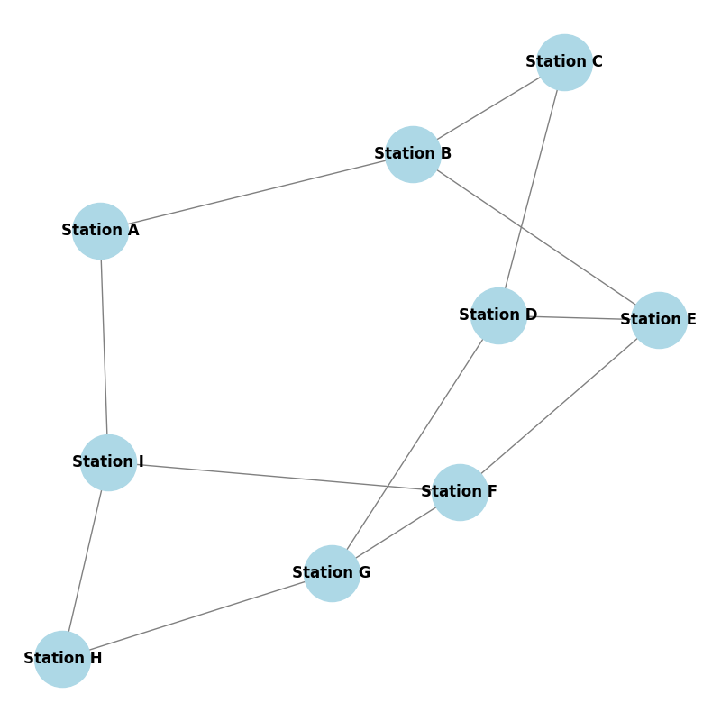

Ось візуалізація простого графіка міської транспортної мережі. Графік складається з таких характеристик:

Кількість вузлів (станцій): 9\
Кількість граней (маршрутів між станціями): 12\
Ступені вузлів (з’єднання на станцію):\
Станція А: 2\
Станція B: 3\
Станція C: 2\
Станція D: 3\
Станція Е: 3\
Станція F: 3\
Станція G: 3\
Станція H: 2\
Станція I: 3\
Цей графік надає приклад того, як транспортну мережу в місті можна представити та проаналізувати за допомогою моделювання мережі.

Шляхи від «станції A» до «станції G», знайдені алгоритмами пошуку в глибину (DFS) і пошуку в ширину (BFS), є такими:

### Шляхи DFS:
1. ['Станція A', 'Станція I', 'Станція H', 'Станція G']
2. ['Станція A', 'Станція I', 'Станція F', 'Станція G']
3. ['Станція A', 'Станція I', 'Станція F', 'Станція E', 'Станція B', 'Станція C', 'Станція D', 'Станція G']
4. ['Станція A', 'Станція I', 'Станція F', 'Станція E', 'Станція D', 'Станція G']
5. ['Станція A', 'Станція B', 'Станція C', 'Станція D', 'Станція G']
6. ['Станція A', 'Станція B', 'Станція C', 'Станція D', 'Станція E', 'Станція F', 'Станція G']
7. ['Станція A', 'Станція B', 'Станція C', 'Станція D', 'Станція E', 'Станція F', 'Станція I', 'Станція H', 'Станція G']
8. ['Станція A', 'Станція B', 'Станція E', 'Станція F', 'Станція G']
9. ['Станція A', 'Станція B', 'Станція E', 'Станція F', 'Станція I', 'Станція H', 'Станція G']
10. ['Станція A', 'Станція B', 'Станція E', 'Станція D', 'Станція G']

### Шляхи BFS:
1. ['Станція A', 'Станція I', 'Станція F', 'Станція G']
2. ['Станція A', 'Станція I', 'Станція H', 'Станція G']
3. ['Станція A', 'Станція B', 'Станція E', 'Станція D', 'Станція G']
4. ['Станція A', 'Станція B', 'Станція E', 'Станція F', 'Станція G']
5. ['Станція A', 'Станція B', 'Станція C', 'Станція D', 'Станція G']
6. ['Станція A', 'Станція I', 'Станція F', 'Станція E', 'Станція D', 'Станція G']
7. ['Станція A', 'Станція B', 'Станція E', 'Станція F', 'Станція I', 'Станція H', 'Станція G']
8. ['Станція A', 'Станція B', 'Станція C', 'Станція D', 'Станція E', 'Станція F', 'Станція G']
9. ['Станція A', 'Станція I', 'Станція F', 'Станція E', 'Станція B', 'Станція C', 'Станція D', 'Станція G']
10. ['Станція A', 'Станція B', 'Станція C', 'Станція D', 'Станція E', 'Станція F', 'Станція I', 'Станція H', 'Станція G']

### Відмінності:
- **DFS** досліджує, наскільки це можливо, уздовж кожної гілки перед поверненням назад. Тому він часто спочатку знаходить довші шляхи, заглиблюючись в одному напрямку, перш ніж перевіряти альтернативні маршрути. Це призводить до різноманітних шляхів з різною довжиною та порядком.
- **BFS** спочатку досліджує найближчих сусідів і систематично шукає всі можливі маршрути рівень за рівнем. Як наслідок, шляхи, знайдені BFS, зазвичай коротші з точки зору кількості країв і, як правило, виявляються в порядку збільшення довжини шляху.

Шляхи відрізняються, оскільки DFS має тенденцію спочатку глибше занурюватися в одному напрямку, можливо, призводячи до більш довгих шляхів перед зворотним відстеженням, тоді як BFS досліджує в ширину, знаходячи коротші шляхи раніше.

|           |   Station A |   Station B |   Station C |   Station D |   Station E |   Station F |   Station G |   Station H |   Station I |
|:----------|------------:|------------:|------------:|------------:|------------:|------------:|------------:|------------:|------------:|
| Station A |           0 |          10 |          13 |          15 |          11 |          12 |          15 |          12 |           2 |
| Station I |           2 |          12 |          15 |          17 |          13 |          10 |          13 |          10 |           0 |
| Station B |          10 |           0 |           3 |           5 |           1 |           8 |          12 |          15 |          12 |
| Station E |          11 |           1 |           4 |           6 |           0 |           7 |          13 |          16 |          13 |
| Station H |          12 |          15 |          12 |          10 |          16 |           9 |           3 |           0 |          10 |
| Station F |          12 |           8 |          11 |          13 |           7 |           0 |           6 |           9 |          10 |
| Station C |          13 |           3 |           0 |           2 |           4 |          11 |           9 |          12 |          15 |
| Station G |          15 |          12 |           9 |           7 |          13 |           6 |           0 |           3 |          13 |
| Station D |          15 |           5 |           2 |           0 |           6 |          13 |           7 |          10 |          17 |

У таблиці показано найкоротші шляхи між усіма парами вузлів на графіку міської транспортної мережі за допомогою алгоритму Дейкстри. Кожна клітинка в таблиці представляє найкоротшу відстань між двома вузлами, враховуючи випадкові ваги, призначені ребрам.

Алгоритм ефективно розраховує мінімальну вартість шляху між кожною парою станцій у мережі, відображаючи оптимальний маршрут на основі ваги країв (відстаней або часу подорожі).